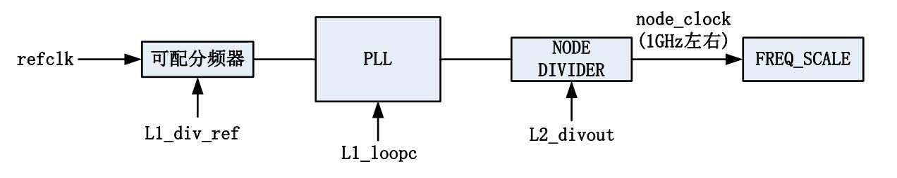

# 龙芯2K1000时钟设置
本节分析龙芯2K1000的时钟架构和PMON中的时钟初始化代码。

## 本节缩略词表

缩略词 | 全称 | 译名
-------|------|------
DFT | Design For Test | 面向实验的设计
PLL | Phase Locked Loop | 锁相环

## 2K1000的时钟相关引脚
2K1000 CPU有三个引脚是与系统时钟相关的：

  * SYS_SYSCLK 该引脚用来外接100MHz参考时钟，其引脚号为F6。在龙芯派中，该引
    脚外接了一颗100MHz晶振。
    
  * SYS_CLKSEL[1:0] 这两个引脚用于配置PLL时钟输入，其引脚号为B2和C3。这两个引脚
    的组合决定了时钟模式：00=低频模式,01=高频模式,10=软件模式(DFT),11=bypass 模
    式。在龙芯派中，SYS_CLKSEL1上拉到3V3，SYS_CLKSEL0接地，因此龙芯派的时钟配置
    模式为10=软件模式（DFT）。当 SYS_CLKSEL[1:0] 设置为 2’b10 时表示 PLL 频率通
    过软件配置。这种配置下，默认对应的时钟频率为外部参考时钟频率，即所有 PLL 输
    出都是 SYS_SYSCLK，需要在处理器启动过程中对时钟进行软件配置。
    
## CPU核心频率设置

核心时钟的产生结构图如下：
  

输出时钟频率的计算方式如下式：
`node_clock=refclk/L1_div_ref*L1_loopc/L2_divout`

