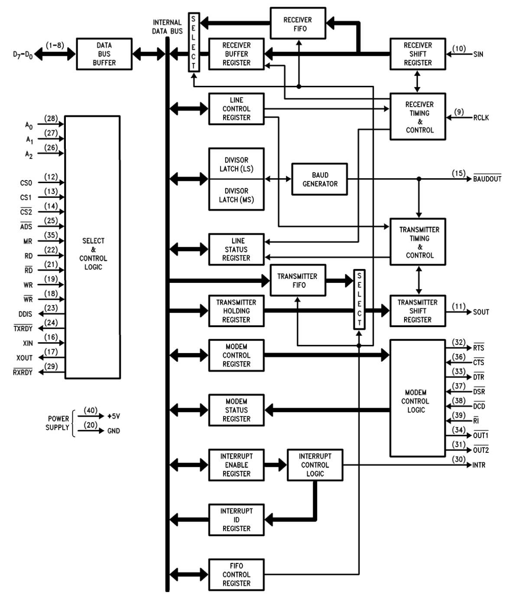

# UART
## 本节缩略词表

缩略词 | 全称 | 译名
-------|------|------
UART | Universal Asynchronous Receiver／Transmitter | 通用异步收发器
RBR | Receiver Buffer Register | 接收器缓冲寄存器
THR | Transmitter Holding Register | 发送器保持寄存器
IER | Interrupt Enable Register | 中断使能寄存器
IIR | Interrupt Identification Register | 中断识别寄存器
FCR | FIFO Control Register | FIFO控制寄存器
LCR | Line Control Register | 线路控制寄存器
MCR | Modem Control Register | Modem控制寄存器
LSR | Line Status Register | 线路状态寄存器
MSR | Modem Status Register | Modem状态寄存器
SCR | Scratch Register | 暂存寄存器
DLL | Divisor Latch (Least Significant Byte) Register | 分频锁存寄存器（最低有效字节）
DLM | Divisor Latch (Most Significant Byte) Register | 分频锁存寄存器（最高有效字节）
DLAB | Divisor Latch Access Bit | 分频因子锁存访问位
FIFO | First In First Out | 先入先出队列


## 龙芯 2K1000 的 UART
龙芯2K1000的用户手册中说，2K1000片内集成了12个UART控制器，其中3个是全功能UART。
2K1000的UART在寄存器与功能上兼容NS16550A。

既然手册中提到了NS16550A，我们就了聊聊它的前世今生。话说1980年代，一代神机IBM PC
上提供了用来连接外部设备的RS232串口，是用一颗叫做8250的芯片实现的。那个时代，串
口可以连接很多设备，比如鼠标、Modem、串行打印机、收银机等，还可以通过RS232串口连
接远程终端，串口是当时最重要的接口之一。然而8250的性能比较弱，于是有很多厂家开始
蹭热度，提供兼容8250但是功能更强的串口扩展卡。其中有家公司做的串口扩展芯片最好，
这家公司就是大名鼎鼎的美国国家半导体公司(National Semiconductor)，它提供的扩展芯
片NS16550A大获成功，各类IBM PC兼容机的串口都采用NS16550A实现，不再使用弱鸡8250，
以后的PC串口都在功能和寄存器上兼容NS16550A。

## NS16550A功能与设置
NS16550A的功能框图如下所示。



NS16550A的主要功能是把CPU提供的并行数据转换成串行数据发送出去，把接收到的串行数
据重新整合成并行数据再交给CPU。为了完成这两个任务，芯片内集成了两个FIFO，也就是
先入先出队列，从CPU传过来的并行数据，先送入发送端FIFO，再通过发送移位寄存器转换
成串行数据发送出去；从外面接收到的串行数据，通过接收移位寄存器转换成并行数据，先
暂存在接收端FIFO中，等待CPU读取。

收发串行数据时，需要设置波特率以及串行数据的格式（也叫帧格式），比如数据占几位？
有几个停止位？有没有奇偶校验位？如果有，是奇校验还是偶校验等等，因此NS16550A芯片
中还提供了几个设置寄存器，以便用户可以进行相关的设置。下面我们了解一下这些寄存器。

### 波特率的设置

NS16550A内部集成了一个波特率发生器，通过分频锁存寄存器(Divisor Latch)可以设置波
特率的值。分频锁存寄存器是两个8位寄存器，一个叫做DLM，用于存放分频系数的高8位；
另一个叫做DLL，用于存放分频系数的低8位。

分频系数可以用下面的公式计算：

`divisor = (frequency input) / (baud rate * 16)`

### 线路控制寄存器（LCR）

线路控制寄存器（LCR）用来说明异步通信时数据的传输格式，比如字符的位数、停止位的个数、奇
偶校验设置等。LCR寄存器的几个位域的作用如下：

  * Bit[1:0] 这两个位规定了每一帧数据中字符所占的位数：
  
  Bit[1:0] | 字符长度
  ---------|---------
  00 | 5 Bits
  01 | 6 Bits
  10 | 7 Bits
  11 | 8 Bits
  
  * Bit[2] 若此位为0，则停止位为1个；若此位为1，则字符位数为5时，有1.5个停止位，
    字符位数为其它值时，有2个停止位。
    
  * Bit[3] 奇偶校验使能位，此位为0，则不采用奇偶校验；此位为1，则采用奇偶校验。
  
  * Bit[4] 奇偶校验选择位，此位为0，则采用奇校验；此位为1，则采用偶校验。
  
  * Bit[7] 这一位是分频锁存访问位（DLAB），此位为1时可以设置或读取波特率分频系数；
    此位为0时，才可以访问接收缓冲寄存器（RBR）、发送保持寄存器（THR）或中断使能
    寄存器（IER）。

### 线路状态寄存器（LSR）

通过这个寄存器可以了解数据传送过程中的状态信息，比如传输过程中是否出错，发送FIFO
是否为空，接收FIFO中是否有数据等

  * Bit[0] 这个位说明接收器中是否有准备好的数据(Data Ready)。此位为1，说明接收器
    缓冲寄存器（RBR）或接收FIFO中收到了一个完整的字符。数据被读出后，此位为0。
    
  * Bit[5] 此位为1，说明发送FIFO为空，也就是数据以及发送出去了；此位为0，说明发
    送FIFO中有数据，也就是数据尚未发送完成。
    
### 数据寄存器（DAT）

NS16550A中，接收缓冲寄存器（RBR）和发送保持寄存器（THR）的地址相同，偏移量均为0。
在龙芯2K1000手册中，把它们统一标注为数据寄存器（DAT）。

发送数据时，只需将字符写入DAT寄存器；接收数据时，只需要读入DAT寄存器。

### FIFO控制寄存器（FCR）
这个寄存器的主要位域如下：
  * Bit[7:6] 设置FIFO引发中断的水位值，00: 1 Byte; 01: 4 Bytes; 10: 8 Bytes; 11:
    14 Bytes
  * Bit[2] 此位为1则清除发送 FIFO 的内容，复位其逻辑
  * Bit[1] 此位为1则清除接收 FIFO 的内容，复位其逻辑

## PMON中串口的初始化及使用

### 串口初始化函数 `initserial` 和 `initserial_later`
在PMON中，串口初始化进行了两次，第一次是刚启动时，UART0的时钟频率默认等于外部参
考时钟频率 100MHz，选择的波特率为115200，据此计算分频系数：

```
divisor = (frequency input) / (baud rate * 16)
        = 100,000,000 / (115200 * 16)
        = 54
        = 0x36
```

串口第一次初始化的代码如下所示，注意，为了可读性，我对代码进行了些许调整，与PMON
中的代码有少许差异：

```assembly
#define COM1_BASE_ADDR 0xbfe00000
#define NS16550_DAT 0x00
#define NS16550_FCR 0x02
#define NS16550_LCR 0x03
#define DLAB (1 << 7)
#define DLL 0x00    // 分频系数低8位
#define DLM 0x01    // 分频系数高8位

LEAF(initserial)
    li  a0, COM1_BASE_ADDR
    li  t1, DLAB
    sb  t1, NS16550_LCR(a0)  # DLAB设置为1，允许访问分频锁存寄存器

    li  t1, 0
    sb  t1, DLM(a0)
    li  t1, 0x36    # 时钟为100MHz，波特率为115200时的分频系数 
    sb  t1, DLL(a0)

1:
    lb  a1, DLL(a0) 
    bne a1, t1, 1b  # 验证分频系数是否写入成功，不成功则循环等待
    nop

    li  t1, 3       # DLAB=0, 字符占8位，一个停止位，无奇偶校验
    sb  t1, NS16550_LCR(a0)

    li  t1, 0x46    # FIFO中断水位设置为4字节，发送FIFO和接收FIFO复位
    sb  t1, NS16550_FCR(a0)
 
    jr ra
    nop
END(initserial)
```

第二次初始化串口，是在设置完系统时钟之后，串口参考时钟被设置为125MHz，因此需要重
新设定分频系数，波特率仍然选择115200，分频系数计算如下：

```
divisor = (frequency input) / (baud rate * 16)
        = 125,000,000 / (115200 * 16)
        = 68
        = 0x44
```

然后重新设定分频系数：

```
LEAF(initserial_later)
    li  a0, COM1_BASE_ADDR
    li  t1, DLAB
    sb  t1, NS16550_LCR(a0)  # DLAB设置为1，允许访问分频锁存寄存器

    li  t1, 0
    sb  t1, DLM(a0)
    li  t1, 0x44    # 时钟为125MHz，波特率为115200时的分频系数 
    sb  t1, DLL(a0)

1:
    lb  a1, DLL(a0) 
    bne a1, t1, 1b  # 验证分频系数是否写入成功，不成功则循环等待
    nop

    li  t1, 3       # DLAB=0, 字符占8位，一个停止位，无奇偶校验
    sb  t1, NS16550_LCR(a0)

    li  t1, 0x46    # FIFO中断水位设置为4字节，发送FIFO和接收FIFO复位
    sb  t1, NS16550_FCR(a0)
 
    jr  ra
    nop
END(initserial_later)
```

### 发送字符 `tgt_putchar`

```assembly
#define COM1_BASE_ADDR 0xbfe00000
#define NS16550_DAT 0x00
#define NS16550_LSR 0x05
#define	LSR_TXRDY 0x20      // 发送端准备好, LSR[5]==1

LEAF(tgt_putchar)
    la  v0, COM1_BASE_ADDR
1:
    lbu v1, NS16550_LSR(v0)
    and v1, LSR_TXRDY
    beqz    v1, 1b          // 发送FIFO不为空，则等待
    nop
                         
    sb a0, NS16550_DAT(v0)  // 发送字符
    jr ra
    nop
END(tgt_putchar)
```

### 接收字符 `tgt_getchar`

```assembly
#define COM1_BASE_ADDR 0xbfe00000
#define NS16550_DAT 0x00
#define NS16550_LSR 0x05
#define	LSR_TXRDY 0x01      // 接收端准备好, LSR[0]==1

LEAF(tgt_getchar)
    la  v0, COM1_BASE_ADDR
1:
    lbu v1, NS16550_LSR(v0)
    and v1, LSR_RXRDY
    beqz    v1, 1b         // 接收端FIFO为空，则等待
    nop
    lb v0, NS16550_DAT(v0) // 读入字符

    jr ra
    nop
END(tgt_getchar)
```

### 发送字符串 `stringserial`

要发送的字符串地址放在a0寄存器中，然后调用`stringserial`发送字符串：
```assembly
LEAF(stringserial)
    move a2, ra     // 保存返回地址
    addu a1, a0, s0 // 重新计算字符串地址，并将字符串新地址存入a1
    lbu a0, 0(a1)   // 将第一个字符放入a0
1:
    beqz    a0, 2f  // 若字符串为空，则跳转到2
    nop
    bal tgt_putchar // 发送一个字符
    addiu a1, 1     // 下一个字符的地址放入a1
    b 1b
    lbu a0, 0(a1)   // 延迟槽指令，下一个字符放入a0
2:
    jr a2
    nop
END(stringserial)
```

### 打印字符串的宏 `PRINTSTR(x)`

这个宏调用`stringserial`把字符串通过串口发送出去：
```assembly
#define	PRINTSTR(x) \
	.rdata; 98: .asciz x; .text; la a0, 98b; bal stringserial; nop
```
